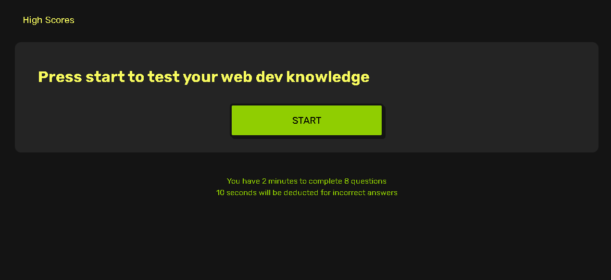
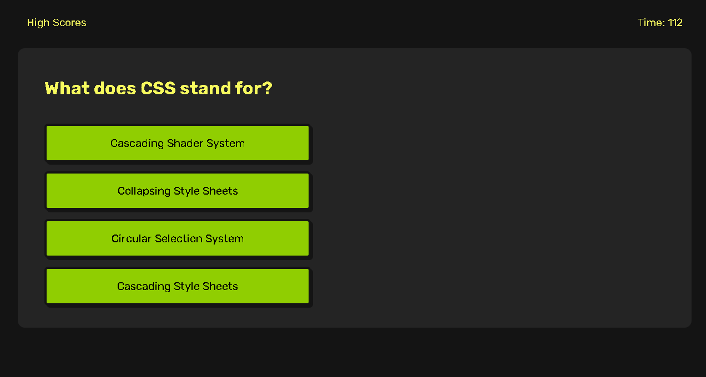
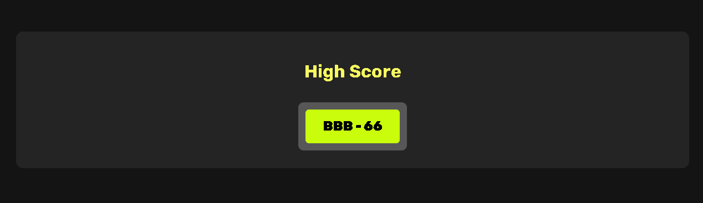

# Web Developer Interview Quiz

## Description

- Test your knowledge of some basic web developer jargon
- If you want to compete with your friends on who knows more this would be a great resource
- You can find thing you didn't know that you didn't know

## Installation

Navigate to the deployed page using the link below to use git clone to copy this code to your machine

## Usage

The deployed page can be found at the following link: [I am a link please click me did I mention im a link](https://tooboi.github.io/Dev-Interview-Quiz/)

- Press the start button to begin after you read the instructions in the footer of the page

    

- Below is an example of the type of questions you will see during this quiz

    

- If you finish all questions or time runs out or you press "High Scores" button you will be directed to your past score

    

## Credits

- [W3Schools](https://www.w3schools.com/)
- [Stack Overflow](https://stackoverflow.com/)
- [Mozilla](https://developer.mozilla.org/en-US/)

## License

Please refer to [license file](./LICENSE)
